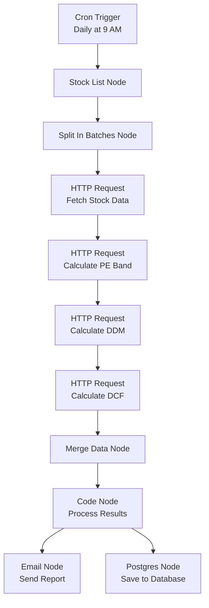
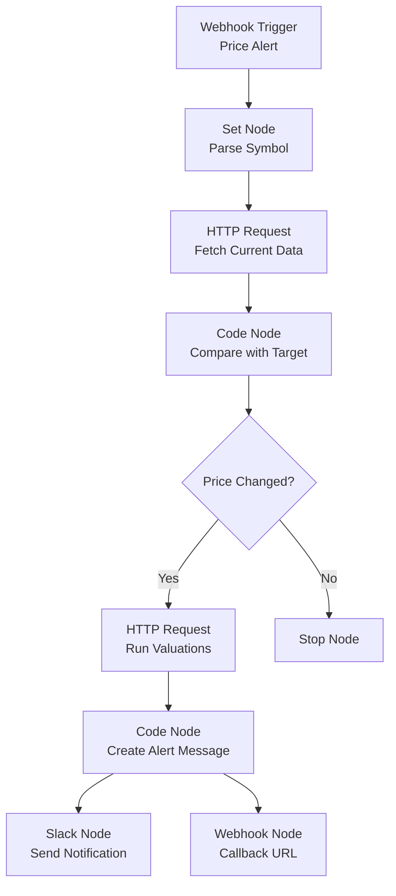
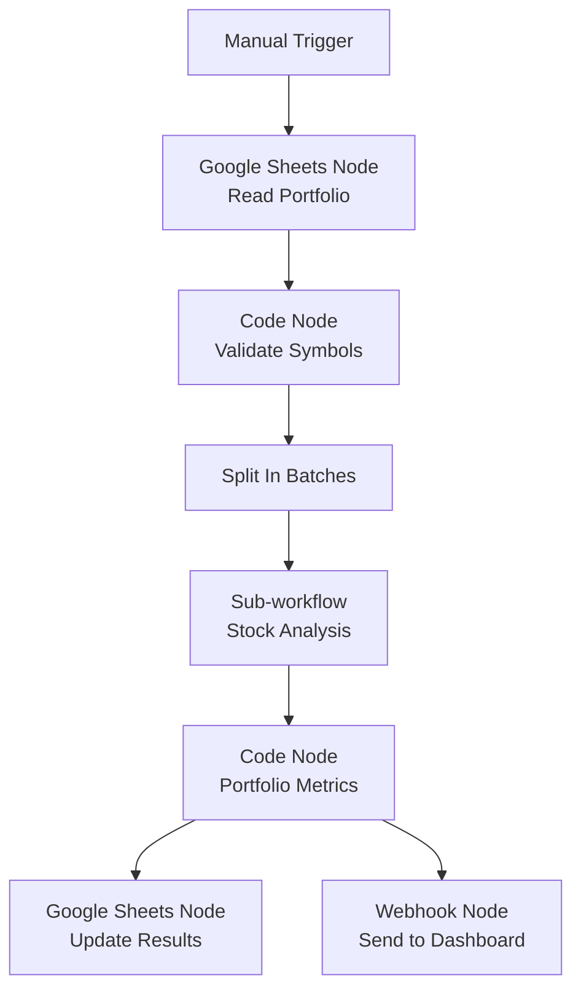
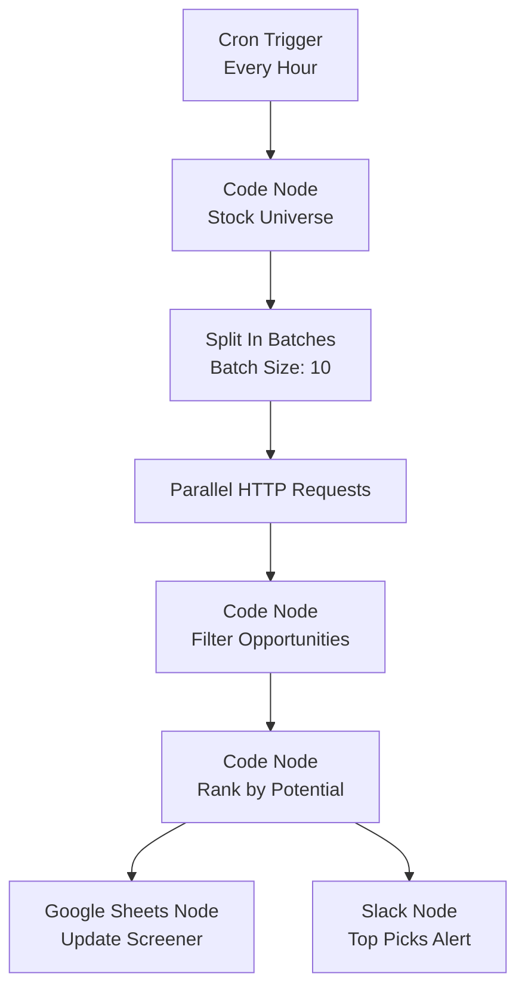
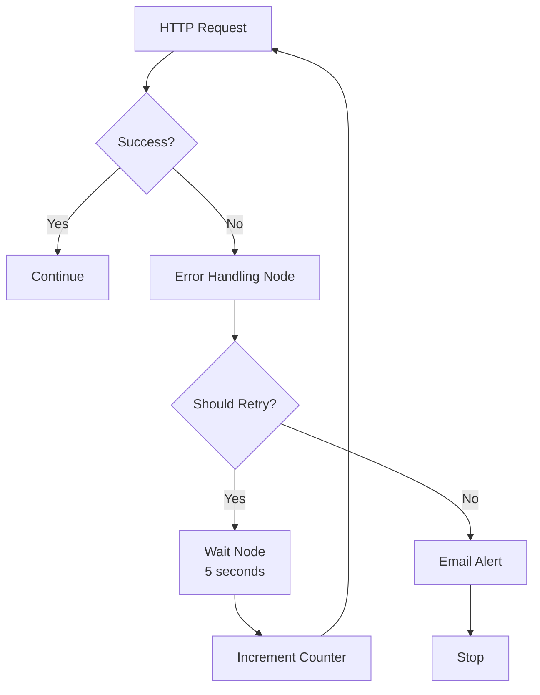

# 🔗 n8n Integration Guide

## Table of Contents
1. [Overview](#overview)
2. [Prerequisites](#prerequisites)
3. [Setup n8n with MCP Server](#setup-n8n-with-mcp-server)
4. [Creating n8n Workflows](#creating-n8n-workflows)
5. [Advanced Integration Examples](#advanced-integration-examples)
6. [Error Handling](#error-handling)
7. [Best Practices](#best-practices)

## Overview

This guide explains how to integrate the Stock Valuation MCP Server with n8n to create automated financial workflows. n8n can connect to the MCP server via HTTP requests, enabling powerful automation scenarios for stock analysis and reporting.

### Integration Architecture

```
┌─────────────┐     ┌────────────────┐     ┌─────────────────┐
│    n8n      │────▶│  HTTP Request  │────▶│ MCP Server      │
│  Workflow   │     │    Node        │     │  (Port 2901)    │
└─────────────┘     └────────────────┘     └─────────────────┘
       │                       │                       │
       ▼                       ▼                       ▼
┌─────────────┐     ┌────────────────┐     ┌─────────────────┐
│  Database   │◀────│  JSON Response │◀────│  Valuation      │
│  Storage    │     │    Node        │     │  Results        │
└─────────────┘     └────────────────┘     └─────────────────┘
```

## Prerequisites

### Required Services
- **n8n Instance** (Cloud or Self-hosted)
- **Stock Valuation MCP Server** running on Oracle Cloud
- **Optional**: Database (PostgreSQL, MySQL) for storing results
- **Optional**: Slack/Email for notifications

### Network Configuration
- MCP Server must be accessible from n8n (public IP or VPN)
- Port 2901 open on Oracle Cloud security list
- HTTPS recommended for production

## Setup n8n with MCP Server

### Method 1: Self-hosted n8n with Docker

#### 1. Create Docker Compose
```yaml
version: '3.8'

services:
  n8n:
    image: n8nio/n8n
    restart: always
    ports:
      - "5678:5678"
    environment:
      - N8N_BASIC_AUTH_ACTIVE=true
      - N8N_BASIC_AUTH_USER=admin
      - N8N_BASIC_AUTH_PASSWORD=your-secure-password
      - WEBHOOK_URL=https://your-n8n-domain.com/
      - GENERIC_TIMEZONE=UTC
    volumes:
      - ./n8n_data:/home/node/.n8n
    networks:
      - app-net

  postgres:
    image: postgres:13
    restart: always
    environment:
      - POSTGRES_USER=n8n
      - POSTGRES_PASSWORD=n8n-password
      - POSTGRES_DB=n8n
    volumes:
      - ./postgres_data:/var/lib/postgresql/data
    networks:
      - app-net

networks:
  app-net:
    driver: bridge
```

#### 2. Start n8n
```bash
docker-compose up -d
```

### Method 2: n8n Cloud

1. Sign up at [n8n.cloud](https://n8n.cloud)
2. Create a new workflow
3. Proceed to integration steps

## Creating n8n Workflows

### 1. HTTP Request Node Configuration

#### Basic Setup
```json
{
  "method": "POST",
  "url": "http://YOUR-MCP-SERVER-IP:2901/mcp",
  "headers": {
    "Content-Type": "application/json"
  },
  "body": {
    "jsonrpc": "2.0",
    "id": 1,
    "method": "tools/call",
    "params": {
      "name": "fetch_stock_data",
      "arguments": {
        "symbol": "{{ $json.symbol }}"
      }
    }
  }
}
```

### 2. Workflow Examples

#### Example 1: Daily Stock Analysis Workflow



**HTTP Request Configuration for Stock Data**:
```json
{
  "method": "POST",
  "url": "http://MCP-SERVER:2901/mcp",
  "body": {
    "jsonrpc": "2.0",
    "id": "{{ $runIndex }}",
    "method": "tools/call",
    "params": {
      "name": "fetch_stock_data",
      "arguments": {
        "symbol": "{{ $json.symbol }}"
      }
    }
  }
}
```

**Code Node for Processing Results**:
```javascript
// Process valuation results
const stockData = $input.first().json;
const peBand = $input.all()[1].json;
const ddm = $input.all()[2].json;
const dcf = $input.all()[3].json;

const analysis = {
  symbol: stockData.data.symbol,
  currentPrice: stockData.data.currentPrice,
  timestamp: new Date().toISOString(),
  valuations: {
    peBand: {
      fairValue: peBand.data.fairValue,
      recommendation: peBand.data.recommendation
    },
    ddm: {
      intrinsicValue: ddm.data.intrinsicValue,
      recommendation: ddm.data.recommendation
    },
    dcf: {
      intrinsicValue: dcf.data.intrinsicValue,
      recommendation: dcf.data.recommendation
    }
  },
  consensus: getConsensus([peBand.data.recommendation, ddm.data.recommendation, dcf.data.recommendation])
};

function getConsensus(recommendations) {
  const counts = {};
  recommendations.forEach(r => {
    counts[r] = (counts[r] || 0) + 1;
  });
  return Object.keys(counts).reduce((a, b) => counts[a] > counts[b] ? a : b);
}

return [{ json: analysis }];
```

#### Example 2: Alert Workflow for Price Changes



**Code Node for Price Comparison**:
```javascript
const currentPrice = $json.data.currentPrice;
const targetPrice = $json.targetPrice;
const threshold = 0.05; // 5% threshold

const priceChange = (currentPrice - targetPrice) / targetPrice;

if (Math.abs(priceChange) >= threshold) {
  return [{
    json: {
      symbol: $json.data.symbol,
      currentPrice: currentPrice,
      targetPrice: targetPrice,
      changePercent: (priceChange * 100).toFixed(2),
      shouldAlert: true,
      alertType: priceChange > 0 ? 'PRICE_UP' : 'PRICE_DOWN'
    }
  }];
}

return [{ json: { shouldAlert: false } }];
```

### 3. Database Integration

#### PostgreSQL Node Setup
```json
{
  "operation": "insert",
  "table": "stock_analyses",
  "columns": [
    "symbol",
    "current_price",
    "pe_fair_value",
    "ddm_value",
    "dcf_value",
    "consensus_recommendation",
    "analysis_date",
    "raw_data"
  ],
  "values": [
    "{{ $json.symbol }}",
    "{{ $json.currentPrice }}",
    "{{ $json.valuations.peBand.fairValue }}",
    "{{ $json.valuations.ddm.intrinsicValue }}",
    "{{ $json.valuations.dcf.intrinsicValue }}",
    "{{ $json.consensus }}",
    "{{ $json.timestamp }}",
    "{{ JSON.stringify($json) }}"
  ]
}
```

## Advanced Integration Examples

### 1. Portfolio Analysis Workflow



**Sub-workflow for Stock Analysis**:
```json
{
  "name": "Stock Analysis",
  "nodes": [
    {
      "name": "Fetch Stock Data",
      "type": "n8n-nodes-base.httpRequest",
      "parameters": {
        "method": "POST",
        "url": "http://MCP-SERVER:2901/mcp",
        "body": {
          "jsonrpc": "2.0",
          "method": "tools/call",
          "params": {
            "name": "fetch_stock_data",
            "arguments": {
              "symbol": "{{ $json.symbol }}"
            }
          }
        }
      }
    }
  ]
}
```

### 2. Market Scanner Workflow



**Code Node for Filtering Opportunities**:
```javascript
const results = $input.all();
const opportunities = [];

results.forEach(item => {
  const data = item.json.data;

  // Filter criteria
  if (data.peBand && data.ddm && data.dcf) {
    const peRecommendation = data.peBand.recommendation;
    const ddmRecommendation = data.ddm.recommendation;
    const dcfRecommendation = data.dcf.recommendation;

    // Count buy recommendations
    const buyCount = [peRecommendation, ddmRecommendation, dcfRecommendation]
      .filter(r => r === 'Buy').length;

    if (buyCount >= 2) {
      opportunities.push({
        symbol: data.symbol,
        currentPrice: data.currentPrice,
        pe: data.pe,
        recommendation: 'STRONG_BUY',
        buySignals: buyCount,
        fairValue: data.peBand.fairValue,
        upside: ((data.peBand.fairValue - data.currentPrice) / data.currentPrice * 100).toFixed(2)
      });
    }
  }
});

// Sort by upside potential
opportunities.sort((a, b) => b.upside - a.upside);

return opportunities.map(op => ({ json: op }));
```

## Error Handling

### 1. Error Node Configuration

```javascript
// Error handling node
const error = $json.error;

if (error) {
  const errorDetails = {
    timestamp: new Date().toISOString(),
    error: error.message,
    code: error.code,
    symbol: $json.input?.symbol || 'UNKNOWN',
    retryCount: $json.retryCount || 0
  };

  // Log error
  console.error('MCP Server Error:', errorDetails);

  // Determine if retry is needed
  if (error.code === 'TIMEOUT' && errorDetails.retryCount < 3) {
    return [{
      json: {
        ...errorDetails,
        shouldRetry: true
      }
    }];
  }

  // Save error to database
  return [{
    json: {
      ...errorDetails,
      shouldRetry: false,
      requiresAttention: true
    }
  }];
}

return [{ json: { success: true } }];
```

### 2. Retry Logic



## Best Practices

### 1. Performance Optimization

- **Batch Processing**: Process stocks in batches of 10-20
- **Parallel Execution**: Use parallel forks for independent valuations
- **Caching**: Cache results to avoid duplicate API calls
- **Rate Limiting**: Implement delays between requests

Example Batching Node:
```javascript
const items = $input.all();
const batchSize = 10;
const batches = [];

for (let i = 0; i < items.length; i += batchSize) {
  batches.push(items.slice(i, i + batchSize));
}

return batches.map(batch => ({ json: batch.map(item => item.json) }));
```

### 2. Data Validation

```javascript
// Validation node
const requiredFields = ['symbol', 'currentPrice', 'pe'];
const data = $json;

const isValid = requiredFields.every(field => {
  const value = data[field];
  return value !== undefined && value !== null && value !== '';
});

if (!isValid) {
  throw new Error(`Missing required fields. Data: ${JSON.stringify(data)}`);
}

return [{ json: data }];
```

### 3. Monitoring and Alerts

```javascript
// Monitoring node
const startTime = new Date();
const endTime = new Date($json.executionTime);
const duration = endTime - startTime;

const metrics = {
  workflowName: 'Stock Analysis',
  executionTime: duration,
  symbolCount: $json.processedSymbols,
  errorCount: $json.errors,
  timestamp: startTime.toISOString()
};

// Send to monitoring service
if (duration > 60000) {
  // Alert if workflow takes more than 1 minute
  console.warn('Slow workflow detected:', metrics);
}

return [{ json: metrics }];
```

### 4. Security Considerations

- **API Keys**: Store API keys in n8n credentials
- **HTTPS**: Always use HTTPS in production
- **IP Whitelisting**: Restrict access to n8n IP
- **Data Encryption**: Encrypt sensitive data

### 5. Scaling Strategies

```javascript
// Dynamic batch sizing based on load
const queueLength = $json.queueLength;
const batchSize = queueLength > 100 ? 50 : 20;

const items = $input.all();
const batches = [];

for (let i = 0; i < items.length; i += batchSize) {
  batches.push({
    json: {
      batch: items.slice(i, i + batchSize),
      batchId: Math.floor(i / batchSize)
    }
  });
}

return batches;
```

## Troubleshooting

### Common Issues

1. **Connection Timeout**
   - Increase timeout in HTTP Request node
   - Check network connectivity
   - Verify MCP server is running

2. **JSON Parsing Errors**
   - Validate JSON structure
   - Use Code node to transform data
   - Check MCP server response format

3. **Rate Limiting**
   - Implement delays between requests
   - Use batch processing
   - Monitor API usage

### Debug Mode

Enable debug logging in n8n:
```bash
# For self-hosted n8n
DEBUG=n8n:* npm start
```

## Example Workflows Repository

Clone example workflows:
```bash
git clone https://github.com/yourusername/n8n-stock-workflows.git
cd n8n-stock-workflows
```

Import workflows into n8n from `workflows/` directory.

## Next Steps

1. [Create custom n8n nodes](./CUSTOM-NODES.md)
2. [Set up monitoring dashboard](./DASHBOARD.md)
3. [Implement backup strategies](./BACKUP.md)